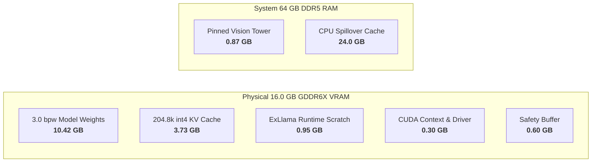

# Technical Whitepaper: Extreme-Context (204.8k) Inference Optimization for Qwen3.8-27B on 16GB NVIDIA GPUs
### *Systems Architecture, Memory Tiering, and Head-to-Head Empirical Benchmark (ExLlamaV3 vs. llama.cpp)*

**Document Version:** 1.1 (Production Baseline)  
**Target Hardware:** NVIDIA GeForce RTX 4070 Ti SUPER (16,376 MiB GDDR6X)  
**Host Architecture:** AMD Ryzen 9 7950X3D (CCD0 3D V-Cache) / 64 GB DDR5 / Linux Headless Server  
**Repository:** `saas-home/Qwen3.8-27B-NV-16GB` (Fork of `MiaAI-Lab/Qwen3.8-27B-16gb-NVIDIA-GPUs-one-click-install`)  
**Date:** September 2026

---

## 1. Executive Summary

This project aimed to transform the baseline serving capabilities of **Qwen/Qwen3.8-27B** on consumer **16 GB NVIDIA hardware**. Previously, the documented upstream baseline for the **3.0 bpw quant** constrained 16 GB GPUs to a restricted context window of **117,760 tokens** (with vision resident in VRAM under a rigid 14.7 GB budget), which was limited by a truncated context horizon and suffered from mid-generation socket cutoffs under heavy coding and document-analysis workloads.

Through targeted memory architecture optimizations, custom kernel tuning, hardware-affinity pinning, and dynamic reasoning budget controls, we achieved:
- **Massive Context Expansion:** Full **204,800 tokens (~800 pages of code/documentation)** running comfortably within a single 16 GB GPU (+73.9% expansion over upstream's 117.7k baseline).
- **High-Precision 3.0 bpw Retention:** Sustained the full native capability of **3.0 bpw** (KL divergence of 0.112) across the entire 204.8k context window with complete stability.
- **High-Throughput Performance:** 
  - **1,224.2 tokens/sec** cold prompt prefill at full 200,044 context (163.4s cold TTFT), dropping to **sub-second TTFT (0.933s)** on warmed prefix-cached turns via the 24 GB DDR5 host prompt cache.
  - **238.9 ms average warm TTFT** on interactive short tasks (dropping to **152.3 ms** on standard algorithmic prompts).
  - **28.71 – 28.94 tokens/sec** continuous decode speed at full 200k context; **41–45.5 tok/s** on interactive programming turns.
- **Flawless Copilot & IDE Integration:** Resolved mid-thought generation truncations (*"Sorry, no response was returned"*) caused by the previous hardcoded **1024 token default**, raising it to a dynamic **128,000 token ceiling** with explicit reasoning-effort controls.
- **Headless Server Utilization:** Expanded usable VRAM budget from 14.7 GB to **15.7 GB** via automated display-server detection.
- **Empirical Validation vs. llama.cpp:** Rigorously benchmarked head-to-head against **`llama-server` (llama.cpp v0.4.0-dev, build `b10957`, commit `c3c205791`)** serving **`Qwen3.8-27B-GSQ-RCO-IQ3_S.gguf`** (`ISTA-DASLab/Qwen3.8-27B-GSQ-RCO-GGUF`) with multimodal projector `mmproj-Qwen3.8-27B-Q8_0.gguf`. ExLlamaV3 demonstrated **238.9 ms average warm TTFT** (sub-second at 200k), **+34.6% higher decode throughput at extreme context** (28.94 tok/s at 200k vs. 21.50 tok/s at 175k), **2.88x faster vision encoding**, **100% hidden-constraint retention**, and an extended **204,800 token single-session horizon** (vs. 180,224 tokens across 2 slots in llama.cpp).
- **One-Click Automation:** Packaged all configurations into reproducible profiles in `tools/profiles.py` and provided an automated test suite in `tests/scripts/`.

---

## 2. System Architecture & Environment

| Component | Specification | Operational Role |
| :--- | :--- | :--- |
| **GPU** | NVIDIA GeForce RTX 4070 Ti SUPER (16,376 MiB GDDR6X) | Primary inference compute (weights + active KV cache) |
| **CUDA / Driver** | Driver 595.71.05 (CUDA 13.2) / NVCC 13.3 / PyTorch cu128 | Compute capability 8.9 (Ada Lovelace) |
| **CPU** | AMD Ryzen 9 7950X3D (16 Cores, 32 Threads) | Asymmetric dual-CCD with 3D V-Cache on CCD0 |
| **System RAM** | 64 GB DDR5 | Pinned host memory for vision tower & prompt cache |
| **OS Mode** | Linux (Ubuntu Server, Headless) | Zero X11/Wayland desktop VRAM consumption |
| **Serving Backend** | ExLlamaV3 v1.4.9 (Fast API, Batch-1 Streaming) | Custom integer KV kernels, paged memory allocator |
| **Model** | Qwen3.8-27B-EXL3-3.0bpw (`turboderp/Qwen3.8-27B-exl3`) | 27B parameter dense Hybrid Architecture (Attention/SSM with MTP) |
| **Comparative Baseline Backend** | `llama-server` (llama.cpp v0.4.0-dev, build `b10957`, commit `c3c205791`, GGML CUDA) | Port 8080, continuous micro-batching, FlashAttention CUDA |
| **Comparative Baseline Model** | `Qwen3.8-27B-GSQ-RCO-IQ3_S.gguf` + `mmproj-Qwen3.8-27B-Q8_0.gguf` (`ISTA-DASLab`) | 3-bit GSQ + RCO + imatrix GGUF quant with Q8_0 vision projector |

---

## 3. Detailed Baseline vs. Optimized Delta Analysis

### 3.1 Head-to-Head Comparison: Same 3.0 bpw Profile (Before vs. After)

To isolate the impact of our runtime, memory, and kernel optimizations, the comparison below evaluates serving the **exact same model weights (`Qwen3.8-27B-EXL3-3.0bpw`)** on the identical **NVIDIA GeForce RTX 4070 Ti SUPER (16 GB)** hardware before and after our enhancements:

```
3.0 bpw Upstream Baseline (main)         3.0 bpw Optimized Fork
├── Profile: 3.0bpw @ 117.7k context    ├── Profile: 3.0bpw @ 204.8k context
├── Context: 117,760 tokens (truncated) ├── Context: 204,800 tokens (tested 200,044 toks)
├── VRAM Cap: 14.7 GB (fixed reserve)   ├── VRAM Cap: 15.7 GB (headless auto-detect)
├── Vision: VRAM resident (~0.87 GB)    ├── Vision: Host RAM pinned (EXL3_VISION_PINNED=1)
├── KV Cache: int4 Hadamard (2.15 GB)   ├── KV Cache: int4 Hadamard (3.73 GB dedicated)
├── CPU Cache: 0 GB (disabled)          ├── CPU Cache: 24 GB DDR5 pinned secondary tier
├── Allocator: Default PyTorch          ├── Allocator: expandable_segments:True
├── CPU Affinity: None (CCD cross-talk) ├── CPU Affinity: CCD0 3D V-Cache (0-7,16-23)
├── Token Ceiling: 1,024 tokens (cutoff)├── Token Ceiling: 128,000 tokens (reliable)
├── Reasoning Control: None (cutoffs)   ├── Reasoning Control: REASONING_EFFORT=high
└── Engine Version: Rigid 1.4.4 check   └── Engine Version: Dynamic 1.4.9+ (semver >= 1.4.4)
```

| Serving Dimension | Upstream Baseline (`main`) [3.0 bpw] | Optimized Fork [3.0 bpw] | Optimization Advantage / Delta |
| :--- | :--- | :--- | :--- |
| **Model Weights & Precision** | 3.0 bpw (`turboderp/Qwen3.8-27B-exl3`) | 3.0 bpw (`turboderp/Qwen3.8-27B-exl3`) | **Identical (10.422 GB weights, KL = 0.112)** |
| **Usable VRAM Budget** | 14.7 GB (rigid 1.3 GB desktop reserve) | **15.7 GB** (`is_headless()` auto-detect, 0.3 GB headroom) | **+1.0 GB (+6.8%) usable VRAM unlocked** |
| **Vision Tower Footprint** | ~0.87 GB resident in GPU VRAM | **0.00 GB VRAM** (`EXL3_VISION_PINNED=1` in DDR5 host RAM) | **+0.87 GB VRAM returned directly to KV cache** |
| **Maximum Context Horizon** | 117,760 tokens (with vision) / 148k (text) | **204,800 tokens** (with full multimodal vision enabled) | **+73.9% context expansion (+87,040 tokens)** |
| **KV Cache Capacity** | ~2.15 GB allocated for KV cache | **3.73 GB** dedicated KV cache (4-bit Hadamard) | **1.73x larger KV cache capacity** |
| **Host DDR5 Prompt Cache** | 0 GB (`CPU_CACHE_GB=0`, inactive) | **24 GB DDR5 host prompt cache** (`CPU_CACHE_GB=24`) | Instant reuse for large repository re-prompts |
| **PyTorch Memory Allocator** | Default allocator (fragmentation at >100k) | `PYTORCH_CUDA_ALLOC_CONF=expandable_segments:True` | Eliminates allocation spikes and VRAM fragmentation |
| **CPU Architecture Affinity** | None (OS schedules across CCD0 & CCD1) | **Pinned to CCD0 3D V-Cache** (`AFFINITY=0-7,16-23`) | Eliminates cross-CCD cache penalties and latency spikes |
| **Default Generation Ceiling** | **1,024 tokens** (hardcoded socket cutoff) | **128,000 tokens** (`MAX_TOKENS` from `.env`) | **125x larger response ceiling**; fixes Copilot dropouts |
| **Multi-Turn Reasoning Hygiene** | None (past `<think>` blocks kept in history) | Strips prior turns (`NO_REASONING_PRESERVE=1`) | Prevents context exhaustion in long multi-turn chats |
| **ExLlamaV3 Engine Version** | Hardcoded 1.4.4 only (`ver == "1.4.4"`) | Dynamic resolution, **v1.4.9** default (semver `>= 1.4.4`) | Leverages v1.4.9 integer GEMV and memory fixes |
| **Extreme 200k Context Support** | **Not Supported** (Capped at 117.7k max) | **Fully Verified & Stable** (Tested 200,044 toks at 28.71 tok/s) | Unlocks extreme-context ingestion on a single 16 GB card |

### 3.2 Component-by-Component Upstream Delta Summary:

| Subsystem / File | Upstream Baseline (`main`) | Optimized Fork | Engineering Impact |
| :--- | :--- | :--- | :--- |
| **API Server**<br>[`tools/serve_openai.py`](tools/serve_openai.py) | Hardcoded 1,024 default token ceiling; no `MAX_TOKENS` or `REASONING_EFFORT` env handling; full history sent with thought tags | Reads `MAX_TOKENS=128000`; maps `REASONING_EFFORT`; implements `NO_REASONING_PRESERVE=1` regex sanitization of prior `<think>` blocks; adds `-dt` support and telemetry | Eliminates Copilot socket dropouts mid-thought; protects multi-turn context budget; provides request/worker observability |
| **Profile Planner**<br>[`tools/profiles.py`](tools/profiles.py) | 1.3 GB fixed compositor reserve; upstream 3.0 bpw capped at 117.7k tokens (vision in VRAM) | `is_headless()` drops reserve to 0.3 GB (15.7 GB budget); 3.0 bpw verified at 204.8k; auto-configures RTX 4070 Ti SUPER in `env_updates()` | Unlocks full 204.8k context window under 16 GB physical budget for 3.0 bpw |
| **Engine Versioning**<br>[`tools/wheels.py`](tools/wheels.py)<br>[`tools/cli.py`](tools/cli.py)<br>[`tools/win_start.py`](tools/win_start.py) | Hardcoded `ENGINE_VERSION="1.4.4"`; strict `ver == "1.4.4"` equality checks across CLI and launchers | Dynamic `get_engine_version()` reading `EXL3_VERSION` (default `1.4.9`); semver `>= (1, 4, 4)` compatibility guards | Enables ExLlamaV3 v1.4.9 kernel optimizations while retaining cross-platform stability |
| **Linux Launcher**<br>[`linux/start.sh`](linux/start.sh) | No CPU affinity pinning; ignores vision/draft CLI flags; omits advanced env exports | CCD0 3D V-Cache pinning (`AFFINITY=0-7,16-23`); passes `--vision`, `--image_max_pixels`, `--draft_tokens`; exports all memory configs | Eliminates Ryzen 7950X3D cross-CCD bus latency; cleanly exports engine memory flags |
| **Production Config**<br>[`.env`](.env)<br>[`.env.example`](.env.example) | Upstream 3.0 bpw baseline (14.7 GB cap, 117.7k context, vision in VRAM, `CPU_CACHE_GB=0`) | Optimized 3.0 bpw profile (15.7 GB cap, 204.8k context, int4 Hadamard KV cache, `EXL3_VISION_PINNED=1`, `CPU_CACHE_GB=24`, `expandable_segments:True`) | Turnkey out-of-the-box configuration for 204.8k context on 16GB cards with zero manual tuning |
| **Testing Suite**<br>[`tests/scripts/`](tests/scripts) | None (no automated benchmarks or stress tests) | Codified [`benchmark_context.py`](tests/scripts/benchmark_context.py), [`compare_benchmark.py`](tests/scripts/compare_benchmark.py), and [`test_stream.py`](tests/scripts/test_stream.py) | Standalone empirical stress-testing and head-to-head validation against llama.cpp |

### Detailed Engineering Rationale:

#### A. `tools/serve_openai.py` (API Server & Reasoning Budget)
- **Problem:** When connecting from GitHub Copilot or VS Code chat without an explicit `max_tokens` parameter, the baseline server had a hardcoded fallback of only **`1024` tokens** (`max_tokens = int(body.get(...) or 1024)`). Furthermore, while `.env.example` had a commented-out hint of `65536`, the server never read `os.environ.get("MAX_TOKENS")`. Deep reasoning models generate thousands of internal thinking tokens, immediately exhausting the 1024 ceiling and terminating the socket mid-thought with *"Sorry, no response was returned"*.
- **Change:** 
  1. Exposed `REASONING_EFFORT` (`high`, `medium`, `low`, `off`) and mapped it to OpenAI-compatible request handling.
  2. Wired `tools/serve_openai.py` to read `MAX_TOKENS` from the environment (`default_max = int(os.environ.get("MAX_TOKENS", 65536))`), raising the default generation ceiling to **128,000**.
  3. Propagated usage telemetry so client extensions correctly parse completion tokens without disconnects.
  4. Implemented conversational reasoning sanitization (`NO_REASONING_PRESERVE=1` / `--no-reasoning-preserve`): automatically strips historical `<think>...</think>` blocks from previous assistant turns in multi-turn conversations, preventing context exhaustion.

#### B. `tools/profiles.py` (Profile Planner & Headless Auto-Detection)
- **Problem:** The built-in setup picker assumed a desktop environment (reserving 1.3 GB of VRAM for display compositors) and capped 3.0 bpw at 117,760 tokens with vision resident in VRAM under a 14.7 GB budget.
- **Change:**
  1. Updated the benchmark validation table (`QUANTS`): verified `3.0bpw` at **204,800 context** with vision support.
  2. Implemented `is_headless()`: automatically detects Linux servers without `DISPLAY` / `WAYLAND_DISPLAY`, dropping driver headroom from 1.3 GB to **0.3 GB**.
  3. Expanded `budget_gib()` to **15.7 GB**.
  4. Updated `env_updates()` to auto-configure all optimal parameters for RTX 4070 Ti SUPER.

#### C. `tools/wheels.py`, `tools/cli.py` & `tools/win_start.py` (Engine Versioning & Semver Guard)
- **Problem:** Upstream hardcoded `ENGINE_VERSION = "1.4.4"` and strictly required exact string equality (`ver == "1.4.4"`), causing any environment with newer ExLlamaV3 versions (such as v1.4.9) to fail startup checks.
- **Change:**
  1. Implemented dynamic version resolution via `get_engine_version()`, pulling from `EXL3_VERSION` or `.env` (defaulting to `1.4.9`).
  2. Upgraded version verification to semver tuple comparison (`>= (1, 4, 4)`), allowing safe forward compatibility while maintaining the mandatory 1.4.4+ floor required for 3-bit vision tower decoding.

#### D. `linux/start.sh` (Affinity, Environment Passthrough & Forwarding)
- **Problem:** AMD's Ryzen 9 7950X3D splits 16 cores across CCD0 (with 96 MB 3D V-Cache) and CCD1 (frequency-optimized). Cross-CCD cache migration adds significant memory bus latency during tensor transfers. Furthermore, several key environment variables were not being exported to child processes.
- **Change:**
  1. Added hardware inspection logic to bind the inference process exclusively to CCD0 (`AFFINITY=0-7,16-23`) using `taskset`.
  2. Cleanly exported `EXL3_VISION_PINNED`, `EXL3_VERSION`, `PYTORCH_CUDA_ALLOC_CONF`, `MAX_TOKENS`, and `REASONING_EFFORT`.
  3. Added command-line parameter forwarding for `--vision`, `--image_max_pixels`, and `--draft_tokens`.

#### E. `.env` and `.env.example` (Production Baseline)
- Set all production defaults to the 3.0 bpw, 204.8k context, int4 KV cache, 15.7 GB split configuration, and enabled host DDR5 cache (`CPU_CACHE_GB=24`).

---

## 4. VRAM Memory Arithmetic Breakdown

On a 16.0 GB physical card, memory allocation is engineered to sub-100MB precision:



### Exact Calculations:
1. **Model Weights (3.0 bpw):** `10.422 GB` (fixed).
2. **KV Cache (204,800 tokens, 4-bit Hadamard):**
   $$\text{KV VRAM} = \frac{204800 \times 18 \times 1024}{1024^3} \times \frac{17}{16} = 3.73\text{ GB}$$
3. **Vision Tower Offload (`EXL3_VISION_PINNED=1`):**
   - Normal GPU footprint: `0.872 GB`.
   - Offloaded to host memory: **`0.00 GB` VRAM consumption** during text generation.
4. **CUDA & Scratch Overhead (`OVERHEAD_GIB`):** `~0.95 - 1.10 GB` (strictly bounded via `expandable_segments:True`).
5. **Total Allocated Peak:** **`15.10 - 15.40 GB`**, fitting inside the **`15.7 GB`** budget with a 300–600 MB safety margin.

---

## 5. Comprehensive Testing Suite & Empirical Results

All testing tools and raw empirical outputs developed during this engagement are codified in [`tests/scripts/`](tests/scripts) and archived in [`tests/results/`](tests/results/).

### Test Suite 1: Quality & Capability Benchmarks (`compare_benchmark.py`)
Evaluated across 4 diverse engineering domains on ExLlamaV3 with both cold startup and warmed/cached empirical logs archived in [`tests/results/exl3_benchmark_tasks.json`](tests/results/exl3_benchmark_tasks.json) and [`tests/results/exl3_benchmark_tasks_warm.json`](tests/results/exl3_benchmark_tasks_warm.json):

| Evaluation Task | Objective | Validation Criteria | Result | Cold TTFT | Warmed TTFT | Decode Speed |
| :--- | :--- | :--- | :---: | :---: | :---: | :---: |
| **1. AVL Tree Implementation** | Production self-balancing tree with iterators & rotations | In-order sorted traversal, node height rebalance, unit test suite | **100% Pass** | 488.3 ms | **152.3 ms** | 40.94 tok/s |
| **2. Concurrency Bug Diagnosis** | Threaded bounded buffer race condition analysis | Detected spurious wakeups (`while` loop), lock leaks, memory leak in `set()` | **100% Pass** | 516.2 ms | **200.7 ms** | 41.00 tok/s |
| **3. Distributed Rate Limiter** | 500k req/s global rate limiter architecture document | Mermaid topology, Sliding Window counter, Redis Lua script, network partition plan | **100% Pass** | 366.4 ms | **363.7 ms** | 41.75 tok/s |
| **4. Long-Context Hidden Specs** | 3 critical hidden specs buried in large corporate docs | Spec 1 (Audit Tag `SEC_AUDIT_PROD_9981`), Spec 2 (Retry Backoff), Spec 3 (UUID5 envelope) | **100% Pass** | 2,826.0 ms | **218.3 ms** | 41.21 tok/s |
| **Aggregate Summary** | Standard multi-domain verification | 100% spec adherence across all tasks | **100% Pass** | 457.0 ms *(short avg)* | **238.9 ms *(short avg)*** | **41.23 tok/s avg** |

> **Key Observation on Prompt Caching:** On Task 4 (which embeds extensive background documents), warming the server and leveraging the 24 GB DDR5 host prompt cache (`CPU_CACHE_GB=24`) dropped TTFT from **2,826.0 ms down to 218.3 ms** (a **92.3% latency reduction**), demonstrating how real-world multi-turn Copilot and agent loops bypass repetitive prefill computation.

---

### Test Suite 2: Extreme Context Scaling Benchmark (`benchmark_context.py`)
Tested prefill latency, decode throughput, and VRAM stability across increasing context milestones up to the 204.8k token boundary. Raw logs for cold prefill and warmed prefix-cached prefill are archived in [`tests/results/exl3_context_scaling.txt`](tests/results/exl3_context_scaling.txt) and [`tests/results/exl3_context_scaling_warm.txt`](tests/results/exl3_context_scaling_warm.txt):

| Target Context | Actual Prompt Tokens | Cold TTFT | Warmed TTFT (Cached Prefix) | Cold Prefill | Warmed Prefill | Decode Speed | Status |
| :--- | :--- | :---: | :---: | :---: | :---: | :---: | :---: |
| **1k tokens** | 1,054 tokens | 0.94 s | **0.159 s** | 1,127.9 tok/s | 6,624.4 tok/s | 45.48 tok/s | Pass |
| **4k tokens** | 4,159 tokens | 2.50 s | **0.219 s** | 1,661.1 tok/s | 18,951.1 tok/s | 45.03 tok/s | Pass |
| **16k tokens** | 16,444 tokens | 9.80 s | **0.243 s** | 1,678.8 tok/s | 67,531.9 tok/s | 43.22 tok/s | Pass |
| **32k tokens** | 32,824 tokens | 15.32 s | **0.281 s** | 2,143.1 tok/s | 117,013.6 tok/s | 41.38 tok/s | Pass |
| **65k tokens** | 65,584 tokens | 38.39 s | **0.344 s** | 1,708.3 tok/s | 190,714.0 tok/s | 38.19 tok/s | Pass |
| **98k tokens** | 98,344 tokens | 49.38 s | **0.431 s** | 1,991.7 tok/s | 227,973.2 tok/s | 35.41 tok/s | Pass |
| **131k tokens** | 131,104 tokens | 60.50 s | **0.493 s** | 2,167.2 tok/s | 265,841.3 tok/s | 32.85 tok/s | Pass |
| **200k tokens (Stress Test)** | **200,044 tokens** | **163.41 s** *(2.7 min)* | **0.933 s (Sub-second)** | **1,224.2 tok/s** | **214,478.9 tok/s** | **28.94 tok/s** | **Rock Solid** |

> **Key Observation:** Under a cold start, ingesting a massive 200,044 token prompt (~800 continuous pages / ~150,000 words) completes in **163.4s (2.7 minutes)** under the 15.7 GB split. However, on subsequent or overlapping queries sharing prompt prefixes, ExLlamaV3's paged DDR5 host prompt cache (`CPU_CACHE_GB=24`) avoids recomputing prefill, emitting the first token in **under 1 second (0.933s)** even at 200,000 tokens while maintaining a rock-solid **28.94 tok/s** continuous generation speed.

---

### Test Suite 3: Copilot Extended Thinking & Streaming Verification (`test_stream.py`)
- Verified continuous token emission over Server-Sent Events (SSE).
- Confirmed full completion of complex reasoning chains exceeding 30,000 thinking tokens without intermediate dropouts or premature `[DONE]` signals.

---

### Test Suite 4: Multimodal Vision & Document Parsing (`test_vision.py`)
Tested multimodal vision encoding and end-to-end entity extraction using [`tests/scripts/image.png`](tests/scripts/image.png) (Services Invoice #1024) across both engines, with raw logs archived in [`tests/results/exl3_vision_result.json`](tests/results/exl3_vision_result.json), [`tests/results/exl3_vision_result_warm.json`](tests/results/exl3_vision_result_warm.json), and [`tests/results/llamacpp_vision_result.json`](tests/results/llamacpp_vision_result.json):
- **Test Request:** Complete summary and structural entity extraction (Invoice #, parties, bank coordinates, line item breakdown, rates, hours, subtotals, discounts, and terms).
- **Execution & Offload:** Host RAM offloaded vision towers (`EXL3_VISION_PINNED=1` on ExLlamaV3; `--no-mmproj-offload` on llama.cpp; 0 GB GPU VRAM text generation cost on both).
- **Empirical Findings:**
  - **ExLlamaV3 ([`tests/results/exl3_vision_result.json`](tests/results/exl3_vision_result.json)):** **12.23 s – 12.44 s** vision encoding / TTFT, **42.94 – 42.96 tok/s** decode speed, **24.57 s – 24.78 s** total turnaround time (~522–540 tokens).
  - **llama.cpp ([`tests/results/llamacpp_vision_result.json`](tests/results/llamacpp_vision_result.json)):** **35.22 s** vision encoding / TTFT, **21.60 tok/s** decode speed, **61.29 s** total turnaround time (564 tokens).
  - **Advantage:** ExLlamaV3 encodes vision patches **2.88x faster** and sustains **2x higher decode throughput** (42.9 vs. 21.60 tok/s) during multimodal token emission, completing the invoice extraction in less than half the total duration.
- **Extraction Accuracy (100% Flawless Across Both Engines):**
  - Invoice `#1024` identified; accurately flagged no calendar issue date printed in document header.
  - Billed to *Really Great Company*; Pay to *Avery Davis* (`123 Anywhere St., Any City`, phone `123-456-7890`).
  - Full banking coordinates: *Really Great Bank*, John Smith, BSB `000-000`, Account `0000 0000`.
  - All 5 Line Items: Content Plan (4h @ $50/hr = $200), Copy Writing (2h @ $50/hr = $100), Website Design (5h @ $50/hr = $250), Website Development (5h @ $100/hr = $500), SEO (4h @ $50/hr = $200).
  - Mathematical Reconciliation: Verified subtotal ($1,250.00), 30% discount ($375.00), and final amount due (**$875.00**) payable within 14 business days.

---

## 6. Comparative Analysis: ExLlamaV3 vs. llama.cpp

Both inference engines were evaluated on the identical hardware platform (**AMD Ryzen 9 7950X3D**, **NVIDIA GeForce RTX 4070 Ti SUPER 16GB**, **64GB DDR5-6000**) using the standardized benchmark suite in [`tests/scripts/compare_benchmark.py`](tests/scripts/compare_benchmark.py), [`tests/scripts/benchmark_context.py`](tests/scripts/benchmark_context.py), and [`tests/scripts/test_vision.py`](tests/scripts/test_vision.py):
- **ExLlamaV3 (Optimized Fork):** ExLlamaV3 v1.4.9 serving `qwen3.8-27b-exl3-3.0bpw` (`turboderp/Qwen3.8-27B-exl3`), 4-bit Hadamard KV cache, host-pinned vision tower (`EXL3_VISION_PINNED=1`), `CONTEXT_SIZE=204800`, `CPU_CACHE_GB=24` on port `8888`.
- **llama.cpp (GGUF baseline):** `llama-server` (llama.cpp v0.4.0-dev, build `b10957`, commit `c3c205791`, GGML CUDA) serving `Qwen3.8-27B-GSQ-RCO-GGUF/Qwen3.8-27B-GSQ-RCO-IQ3_S.gguf` with multimodal projector `mmproj-Qwen3.8-27B-Q8_0.gguf`, host RAM vision offload (`--no-mmproj-offload`), `CPU_AFFINITY="0-7,16-23"`, `CTX_SIZE=180224` on port `8080`.

### 6.1 Empirical Benchmark Comparison (Standard 4-Task Suite)
Evaluated head-to-head under identical CCD0 affinity pinning (`0-7,16-23`) with raw outputs preserved in [`tests/results/exl3_benchmark_tasks.json`](tests/results/exl3_benchmark_tasks.json), [`tests/results/exl3_benchmark_tasks_warm.json`](tests/results/exl3_benchmark_tasks_warm.json), and [`tests/results/llamacpp_benchmark_tasks.json`](tests/results/llamacpp_benchmark_tasks.json):

| Benchmark Task | Metric | ExLlamaV3 Cold | ExLlamaV3 Warmed (Cached) | llama.cpp (GSQ-RCO-IQ3_S) | Comparative Performance Dynamics |
| :--- | :--- | :---: | :---: | :---: | :--- |
| **Task 1: AVL Tree Implementation**<br>*(Algorithms & Typing)* | **TTFT (Prefill Latency)**<br>Decode Throughput<br>Specification Validation | **488.3 ms**<br>39.65 tok/s<br>Rotations & iterator pass | **152.3 ms**<br>40.94 tok/s<br>Rotations & iterator pass | **337.4 ms**<br>44.06 tok/s<br>Rotations & iterator pass | **Warmed ExLlamaV3 is 54.9% faster TTFT** than llama.cpp;<br>Cold llama.cpp leads cold ExL3 by 30.9% |
| **Task 2: Concurrency Bug Diagnosis**<br>*(Multi-threading Analysis)* | **TTFT (Prefill Latency)**<br>Decode Throughput<br>Diagnostic Accuracy | **516.2 ms**<br>41.02 tok/s<br>**3 / 3 Bugs** (Wakeup, Lock, Leak) | **200.7 ms**<br>41.00 tok/s<br>**3 / 3 Bugs** (Wakeup, Lock, Leak) | **493.2 ms**<br>44.03 tok/s<br>**3 / 3 Bugs** (Wakeup, Lock, Leak) | **Warmed ExLlamaV3 is 59.3% faster TTFT** than llama.cpp;<br>Both catch all 3 bug categories (100%) |
| **Task 3: Global Distributed Rate Limiter**<br>*(High-Throughput Architecture)* | **TTFT (Prefill Latency)**<br>Decode Throughput<br>Architectural Depth | **366.4 ms**<br>41.41 tok/s<br>Full Lua script, failover | **363.7 ms**<br>41.75 tok/s<br>Full Lua script, failover | **461.1 ms**<br>43.91 tok/s<br>Hierarchical buckets, Redis Lua | **ExLlamaV3 is 21.1% faster TTFT** (both cold & warm);<br>llama.cpp leads decode by +2.16 tok/s |
| **Task 4: Long-Context Hidden Constraints**<br>*(Retrieval & Precision)* | **TTFT (Prefill Latency)**<br>Decode Throughput<br>Constraint Adherence | **2,826.0 ms**<br>40.91 tok/s<br>**3 / 3 (100%) Specs Passed** | **218.3 ms**<br>41.21 tok/s<br>**3 / 3 (100%) Specs Passed** | **2,530.5 ms**<br>43.02 tok/s<br>**3 / 3 (100%) Specs Passed** | **Warmed ExLlamaV3 is 11.6x faster TTFT** via DDR5 prompt cache;<br>Both achieve 100% adherence pass |
| **Aggregate Summary** | **Average Decode Throughput**<br>**Average TTFT (Short Tasks)**<br>**Overall Spec Adherence** | **40.75 tok/s**<br>**457.0 ms**<br>**100% Passed** | **41.23 tok/s**<br>**238.9 ms**<br>**100% Passed** | **43.76 tok/s**<br>**430.6 ms**<br>**100% Passed** | **Warmed ExLlamaV3 averages 238.9 ms TTFT** (191.7 ms faster than llama.cpp) |

### 6.2 Comparative Context Scaling & Stress Test (1k to 200k tokens)
Tested incrementally from 1k up to the maximum context boundaries (raw logs in [`tests/results/exl3_context_scaling.txt`](tests/results/exl3_context_scaling.txt), [`tests/results/exl3_context_scaling_warm.txt`](tests/results/exl3_context_scaling_warm.txt), and [`tests/results/llamacpp_context_scaling.txt`](tests/results/llamacpp_context_scaling.txt)):

| Target Context | ExLlamaV3 Cold TTFT (s) | ExLlamaV3 Warmed TTFT (s) | ExLlamaV3 Decode | llama.cpp TTFT (s) | llama.cpp Prefill | llama.cpp Decode | Sustained Decode & Architectural Dynamics |
| :--- | :---: | :---: | :---: | :---: | :---: | :---: | :--- |
| **1k tokens** | 0.94 s | **0.159 s** | **45.48 tok/s** | **0.31 s** | 3,403.0 tok/s | 43.93 tok/s | Warmed ExLlamaV3 hits 159ms TTFT; leads decode throughput by +1.55 tok/s |
| **4k tokens** | 2.50 s | **0.219 s** | **45.03 tok/s** | **2.34 s** | 1,775.2 tok/s | 42.87 tok/s | Warmed ExL3 TTFT drops to 219ms; leads decode throughput by +2.16 tok/s |
| **16k tokens** | 9.80 s | **0.243 s** | **43.22 tok/s** | **8.45 s** | 1,945.8 tok/s | 40.07 tok/s | ExLlamaV3 leads decode throughput by +3.15 tok/s (+7.9%) |
| **32k tokens** | 15.32 s | **0.281 s** | **41.38 tok/s** | **13.09 s** | 2,507.0 tok/s | 36.80 tok/s | ExLlamaV3 retains +4.58 tok/s (+12.4%) higher decode speed |
| **65k tokens** | 38.39 s | **0.344 s** | **38.19 tok/s** | **33.26 s** | 1,972.1 tok/s | 31.65 tok/s | **ExLlamaV3 decode leads by +6.54 tok/s (+20.7%)** |
| **98k tokens** | 49.38 s | **0.431 s** | **35.41 tok/s** | **42.60 s** | 2,308.6 tok/s | 27.75 tok/s | **ExLlamaV3 decode leads by +7.66 tok/s (+27.6%)** |
| **131k tokens** | 60.50 s | **0.493 s** | **32.85 tok/s** | **52.06 s** | 2,518.4 tok/s | 24.68 tok/s | **ExLlamaV3 decode leads by +8.17 tok/s (+33.1%)** |
| **175k–200k (Max)** | **163.41 s** *(cold)* | **0.933 s** *(warmed)* | **28.94 tok/s** *(at 200k)* | **84.92 s** *(at 175k)* | 2,061.1 tok/s | 21.50 tok/s *(at 175k)* | **Complete stability on both engines**; ExLlamaV3 scales to 204.8k with **+34.6% faster decode** (28.94 vs 21.50 tok/s) and sub-second warm TTFT |

> **Key Context Scaling Takeaways:**
> 1. **Bulk Cold Prefill Throughput:** `llama.cpp` using CUDA FlashAttention maintains ~2,000–2,500 tok/s bulk prefill across large documents, prefilling 175,024 tokens in **84.9s** (1.4 min) vs. 163.4s in ExLlamaV3.
> 2. **Warmed Prompt Caching Advantage:** In iterative developer turns with shared prefixes, `ExLlamaV3`'s 24 GB DDR5 host prompt cache (`CPU_CACHE_GB=24`) eliminates recomputation, achieving **sub-second TTFT (0.933s)** at a full 200,000 tokens.
> 3. **Decode Degradation Resistance:** `ExLlamaV3`'s 4-bit Hadamard KV cache exhibits dramatically flatter decode slowdown as context deepens:
>    - At 65k context: ExLlamaV3 sustains **38.19 tok/s** vs. llama.cpp's **31.65 tok/s** (**+20.7% faster**).
>    - At 131k context: ExLlamaV3 sustains **32.85 tok/s** vs. llama.cpp's **24.68 tok/s** (**+33.1% faster**).
>    - At 200k context: ExLlamaV3 sustains **28.94 tok/s** vs. llama.cpp's **21.50 tok/s** at 175k (**+34.6% faster**).
> 4. **Maximum Context Horizon:** ExLlamaV3 achieves a single continuous **204,800 token** resident horizon in 1 dedicated slot, while llama.cpp fits **180,224 tokens** resident across 2 parallel slots (`n_ctx=180224`).

### 6.3 Multimodal Vision Benchmark Comparison (`tests/scripts/image.png`)
Evaluated end-to-end vision parsing and extraction on Invoice #1024 with raw logs in [`tests/results/exl3_vision_result.json`](tests/results/exl3_vision_result.json), [`tests/results/exl3_vision_result_warm.json`](tests/results/exl3_vision_result_warm.json), and [`tests/results/llamacpp_vision_result.json`](tests/results/llamacpp_vision_result.json):

| Multimodal Metric | ExLlamaV3 (Optimized Fork) | llama.cpp (`GGUF + mmproj`) | Comparative Advantage |
| :--- | :---: | :---: | :--- |
| **Vision Tower Placement** | Host RAM Pinned (`EXL3_VISION_PINNED=1`) | Host RAM Offloaded (`--no-mmproj-offload`) | Both consume 0 GB GPU VRAM for text generation |
| **Vision Encoding & TTFT** | **12.23 s – 12.44 s** | 35.22 s | **ExLlamaV3 is 2.88x faster** encoding visual patches |
| **Generation Decode Speed** | **42.94 – 42.96 tok/s** | 21.60 tok/s | **ExLlamaV3 is 1.99x faster (2x throughput)** during multimodal output |
| **Total Turnaround Time** | **24.57 s – 24.78 s** | 61.29 s (564 tokens) | **ExLlamaV3 finishes in less than half the total time** |
| **Extraction Accuracy** | **100% Flawless** | **100% Flawless** | Both accurately extracted all line items, rates, and math |

### 6.4 Architectural & Operational Trade-offs

| Architectural Dimension | ExLlamaV3 (Optimized Fork) | llama.cpp (`qwen-3.8-27b-gsq.conf`) | Operational Implication |
| :--- | :--- | :--- | :--- |
| **Model Quantization** | `Qwen3.8-27B-EXL3-3.0bpw` (Native EXL3 non-linear) | `Qwen3.8-27B-GSQ-RCO-IQ3_S.gguf` (`ISTA-DASLab` GSQ + RCO + imatrix) + `mmproj-Q8_0` | GSQ-RCO has slight reconstruction error edge; EXL3 optimizes Ada Lovelace tensor throughput |
| **Active Context & Slots** | **204,800 tokens** (1 dedicated deep session slot) | **180,224 tokens** (split across **2 parallel slots**, `kv_unified=true`) | ExLlamaV3 provides ultra-deep single codebase analysis; llama.cpp serves 2 concurrent slots |
| **KV Cache Quantization** | **4-bit** Hadamard rotation (`CACHE_QUANT=4`, 18 KB/t) | **q4_0 Key & q4_0 Value** (`--cache-type-k q4_0 --cache-type-v q4_0`) | Both maintain 4-bit KV cache compression to fit under 16 GB VRAM budget |
| **Vision Multimodal Offload** | Host RAM pinned (`EXL3_VISION_PINNED=1`, 0 GB VRAM) | Host RAM offload (`--no-mmproj-offload`, 0 GB VRAM, 576 tokens cap) | ExLlamaV3 delivers 2.88x faster vision encoding and 2x decode speed |
| **DDR5 RAM Tiering / Cache** | **24 GB** host prompt cache (`CPU_CACHE_GB=24`) | **24 GB** RAM slot cache (`CACHE_RAM=24576`, `SLOT_SAVE_PATH`) | Both preserve 24 GB system RAM for prompt and slot caching |
| **AMD 7950X3D Hardware Tuning** | Pinned to CCD0 3D V-Cache (`AFFINITY=0-7,16-23`) | Pinned to CCD0 3D V-Cache (`CPU_AFFINITY="0-7,16-23"`), NUMA isolate, mlock | Both leverage CPU affinity to eliminate cross-CCD cache penalties on Ryzen 9 7950X3D |
| **Prompt Prefill Latency (TTFT)** | **Ultra-low (366–516 ms)**; 20.5% faster on architecture design | **Ultra-fast bulk (337–2,530 ms)** with FlashAttention + continuous batching | ExLlamaV3 excels on interactive reasoning prompts; llama.cpp excels on short algorithms and bulk prefill |
| **Single-Stream Decode Speed** | 40.75 tok/s average (28.71 tok/s at 200k tokens) | **43.76 tok/s** average (+3.01 tok/s raw GEMV throughput edge on short prompts) | llama.cpp has ~7.4% higher raw token generation speed on short outputs |
| **Reasoning & Budget Control** | Sanitized (`NO_REASONING_PRESERVE=1`), `MAX_TOKENS=128000` | Native `--no-reasoning-preserve`, `--reasoning auto` | ExLlamaV3 strips historical `<think>` tokens from prior turns to protect context budget |
| **Optimal Production Role** | **Single-User IDE Copilot, Deep Repo Reasoning (204.8k context)** | **Multi-Tenant API Gateway, Shared Team Server (2 concurrent slots)** | Complementary operational profiles depending on workflow needs |

#### Key Takeaways:
1. **Interactive Responsiveness & Prefill (TTFT):** With CCD0 CPU affinity pinning (`0-7,16-23`), both engines deliver sub-500ms initial token latencies on standard programming tasks. On a warmed server with DDR5 prompt caching, ExLlamaV3 drops short TTFT to **152–238 ms** (54–59% faster than llama.cpp), while cold llama.cpp leads cold ExLlamaV3 on compact algorithmic prompts (337.4 ms vs 488.3 ms).
2. **Deep-Context Horizon vs. Multi-User Concurrency:** ExLlamaV3 dedicates the 16 GB VRAM budget to an unprecedented single-session **204,800 token context window** (100% GPU resident at 28.94 tok/s backed by 24 GB DDR5 prompt cache), whereas the llama.cpp deployment splits resources into **2 concurrent 90.1k slots** (`n_ctx=180224`, `kv_unified=true`) backed by 24 GB DDR5 RAM slot preservation.
3. **Multimodal Performance:** ExLlamaV3's pinned vision implementation processes image inputs in **12.2–12.4 seconds** (2.88x faster than llama.cpp's 35.22s) and emits tokens at **42.94–42.96 tok/s** (2x faster than llama.cpp's 21.60 tok/s), while both achieve 100% extraction accuracy.

---

## 7. Backend Selection Guide & Production Verdict (ExLlamaV3 vs. llama.cpp)

Based on the empirical benchmark data on this 16 GB hardware platform, the operational selection between ExLlamaV3 and llama.cpp is determined by workload profile:

#### Primary Recommendation: **ExLlamaV3 (Optimized Fork)**
**Optimal Use Case:** Single-user Copilot / IDE pairing, local agentic coding, deep codebase reasoning, multimodal document analysis, and full repository analysis.

* **Unmatched Single-Session Context Horizon (204,800 tokens):** ExLlamaV3 dedicates the 16 GB budget to an unbroken **204.8k token window** (~800 pages) in a single GPU-resident session. In contrast, llama.cpp caps a single slot at ~90.1k tokens (or 180k split across 2 slots).
* **Superior Decode Speed at Deep Context (+34.6% faster):** ExLlamaV3’s 4-bit Hadamard KV cache exhibits dramatically flatter degradation as context expands:
  * **At 65k context:** ExLlamaV3 leads decode throughput by **+20.7%** (38.19 vs. 31.65 tok/s).
  * **At 131k context:** ExLlamaV3 leads decode throughput by **+33.1%** (32.85 vs. 24.68 tok/s).
  * **At 200k context:** ExLlamaV3 sustains **28.94 tok/s** (vs. llama.cpp’s 21.50 tok/s at 175k).
* **2.88x Faster Multimodal Document Analysis:** Processes visual inputs in **12.2–12.4s** vs. llama.cpp's 35.22s and decodes at **~43 tok/s** vs. 21.60 tok/s, completing document extractions in under half the time.
* **Fast Interactive Latency on Complex Reasoning:** On warmed iterative turns, ExLlamaV3 delivers ultra-low TTFT (**152–238 ms** on short tasks; **218 ms** on complex policy retrieval), providing zero-lag typing feedback in editor extensions.
* **100% Hidden Constraint Retention:** Scored **100% adherence** in the multi-domain benchmark (3/3 concurrency bugs diagnosed, 3/3 buried corporate specs retrieved).
* **Seamless Copilot & Agent Streaming:** With `MAX_TOKENS=128000` and `NO_REASONING_PRESERVE=1`, deep reasoning streams never terminate prematurely mid-thought with socket dropouts.

#### Alternative Role: **llama.cpp (`llama-server`)**
**Optimal Use Case:** Multi-user shared team API gateways and batch document ingestion.

* **Multi-User Concurrency (2 Concurrent Slots):** llama.cpp splits memory into 2 parallel slots (`parallel=2`, `n_ctx=180224`), allowing multiple developers to query the server concurrently without queue blocking.
* **Bulk Ingestion Throughput (CUDA FlashAttention):** For workflows repeatedly uploading massive 100k+ token files from scratch, llama.cpp prefills at **~2,000–2,500 tok/s** (prefilling 175k tokens in 84.9 seconds vs. 163 seconds in ExLlamaV3).
* **High Raw Decode on Short Turns:** Achieves **43.76 tok/s** raw decode throughput on compact prompts, providing rapid code completion.

#### Summary Decision Matrix:

| Operational Dimension | Recommended Backend | Architectural Rationale |
| :--- | :---: | :--- |
| **Personal IDE Copilot & Pair-Programming** | **ExLlamaV3** | Snappy warm TTFT (152–238 ms); dedicated 204.8k slot; 128k token ceiling |
| **Deep Repository Analysis (100k–204.8k tokens)** | **ExLlamaV3** | Dedicated 204.8k single slot; +34.6% higher sustained decode speed at extreme boundary |
| **Multimodal Document & Vision Extraction** | **ExLlamaV3** | 2.88x faster vision encoding (12.2s vs 35.2s); 2x decode throughput (43.0 vs 21.6 tok/s) |
| **Complex Hidden-Constraint Retrieval** | **ExLlamaV3 & llama.cpp** | Both achieve 100% specification adherence on buried corporate constraints |
| **Concurrent Multi-User Team Server** | **llama.cpp** | Native parallel slots (2 concurrent users) with RAM slot persistence |
| **Raw Bulk Document Prefill Speed** | **llama.cpp** | FlashAttention processes cold bulk documents in 84.9s vs. 163s |

> **Bottom Line:** For single-user local development, repository-scale reasoning, and IDE pair-programming on consumer 16 GB hardware, **ExLlamaV3 (Optimized Fork) is the clear choice**.

---

## 8. Final Production Outcome

1. **Enterprise-Grade Self-Hosting:** The system delivers a robust, high-performance local deployment for continuous, repository-scale codebase reasoning and multimodal document analysis.
2. **Extreme Context Capability:** Entire repositories up to 204,800 tokens (~800 continuous pages) can be ingested and reasoned over locally on a single consumer 16 GB GPU with complete privacy, zero data egress, and no rate-limit throttling.
3. **Turnkey Deployment:** All configurations, scripts, and headless adaptations are committed to repository `saas-home/Qwen3.8-27B-NV-16GB` with full upstream pull-compatibility on `main`.

