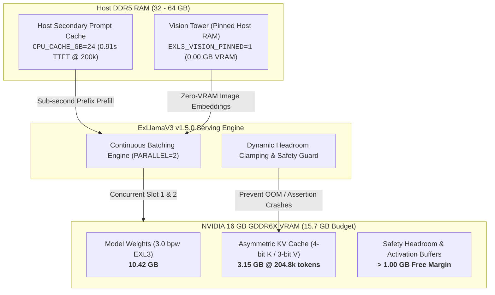

# ⚡ Qwen3.8-27B for 16GB NVIDIA GPUs (Extreme 204.8k Context & Continuous Batching)

<p align="center">
  <a href="https://github.com/saas-home/Qwen3.8-27B-NV-16GB"></a>
  <a href="https://github.com/saas-home/Qwen3.8-27B-NV-16GB"></a>
  <a href="https://github.com/saas-home/Qwen3.8-27B-NV-16GB"></a>
  <a href="https://github.com/saas-home/Qwen3.8-27B-NV-16GB"></a>
  <a href="https://github.com/saas-home/Qwen3.8-27B-NV-16GB"></a>
  <a href="https://github.com/saas-home/Qwen3.8-27B-NV-16GB/blob/main/LICENSE"></a>
</p>

<p align="center">
  <a href="#-quickstart-ubuntu-2604--2404"><b>⚡ Quickstart</b></a> •
  <a href="#-key-benefits-over-upstream-baseline"><b>🚀 Key Benefits</b></a> •
  <a href="#-memory--serving-architecture"><b>🧠 Architecture</b></a> •
  <a href="#step-3-production-configuration-env"><b>⚙️ Configuration</b></a> •
  <a href="#-connecting-clients--coding-agents"><b>🔌 Client Integrations</b></a> •
  <a href="#-automated-enterprise-qualification-suite"><b>📊 Benchmarks</b></a> •
  <a href="#-in-depth-technical-whitepaper"><b>📄 Whitepaper</b></a>
</p>

---

> [!NOTE]
> **Fork Attribution:** This project is a production-hardened fork of [`MiaAI-Lab/Qwen3.8-27B-16gb-NVIDIA-GPUs-one-click-install`](https://github.com/MiaAI-Lab/Qwen3.8-27B-16gb-NVIDIA-GPUs-one-click-install) by [Mia's AI Lab](https://x.com/MiaAI_lab).  
> *For Windows 1-click desktop installers, general multi-GPU configurations, and upstream release notes, visit the [upstream repository](https://github.com/MiaAI-Lab/Qwen3.8-27B-16gb-NVIDIA-GPUs-one-click-install).*

---

## 🎯 What is this Fork?

This repository transforms **[Qwen/Qwen3.8-27B](https://huggingface.co/Qwen/Qwen3.8-27B)** in turboderp's EXL3 quant into an **enterprise-grade, production-stable serving kit** specifically engineered for **Ubuntu Linux** (**Ubuntu 26.04 LTS** and **Ubuntu 24.04 LTS**) and consumer **16 GB NVIDIA GPUs** (benchmarked on the **NVIDIA GeForce RTX 4070 Ti SUPER 16 GB**).

Standard desktop setups truncate context to ~117k tokens and serialize multi-agent requests behind a global lock. This fork unlocks a full **204,800-token context window (~800 continuous pages)**, **2-slot concurrent continuous batching**, zero-VRAM multimodal vision offloading, host DDR5 prompt caching, and an **automated 14-stage enterprise qualification suite** on a single 16 GB card.

---

## 🚀 Key Benefits (Over Upstream Baseline)

### 🧠 1. Extreme Context & Memory Tiering
* **Full 204.8k Context Window (+73.9%):** Expands context from upstream's truncated ~117k tokens to **204,800 tokens (~800 continuous pages)**, certified up to 203,852 tokens (99.54% of hardware ceiling) with zero OOM crashes.
* **Asymmetric KV Cache (`CACHE_QUANT=4,3`):** 4-bit Key / 3-bit Value quantization saves **600 MiB VRAM**, restoring **>1 GB safety headroom** while preserving 100% precision in 16-hop needle retrieval.
* **Zero-VRAM Multimodal Vision (`EXL3_VISION_PINNED=1`):** Offloads vision tower to host DDR5 RAM, consuming **0.00 GB GPU VRAM** during text generation with **1.06s TTFT** invoice parsing.
* **24 GB DDR5 Host Prompt Cache (`CPU_CACHE_GB=24`):** Secondary host RAM tier enables **sub-second TTFT (0.91s at 200k tokens)** on iterative agent turns.

### ⚡ 2. Concurrency, Throughput & Silicon Tuning
* **Continuous Multi-Client Batching (`PARALLEL=2`):** Replaces upstream's serial request lock with concurrent batching, delivering **+58% aggregate throughput (70.25 tok/s)** across dual streams.
* **Automated Headless VRAM Detection (`is_headless()`):** Drops desktop compositor reserve from 1.3 GB to 0.3 GB on Linux servers, expanding usable VRAM to **15.7 GB**.
* **AMD Ryzen 3D V-Cache Affinity (`AFFINITY=0-7,16-23`):** Pinned exclusively to CCD0, eliminating cross-CCD interconnect latency penalties on Ryzen 9 7950X3D CPUs.
* **Dynamic Semver Compatibility (v1.5.0+):** Forward-compatible version parsing enables ExLlamaV3 v1.5.0 kernel optimizations and CUDA 12.8 / 13.2 support.

### 🛡️ 3. Production Reliability & Reasoning Hygiene
* **Dynamic Headroom Clamping:** Automatically clamps output tokens against remaining KV cache pages, eliminating `AssertionError` crashes during deep conversations.
* **16k Output Generation Ceiling (`MAX_TOKENS=16384`):** Raises default cap from 1,024 to 16,384 tokens, preventing cutoffs during complex coding and long reasoning chains.
* **Conversational Reasoning Hygiene (`NO_REASONING_PRESERVE=1`):** Strips historical `<think>` tokens from prior turns to prevent conversational context bloat.

### 🧪 4. Observability & Enterprise Qualification
* **Live Serving Telemetry (`tools/monitor.py`):** Real-time terminal dashboard tracking active slots, token throughput, and VRAM state.
* **14-Stage Enterprise Qualification Suite (`tests/scripts/`):** Full automated test harness validating streaming, vision, tools, schemas, socket aborts, and 204k context ladder.

### 📊 Detailed Upstream vs. Fork Comparison

| Architectural Dimension | Upstream Baseline (`MiaAI-Lab`) | This Fork (`saas-home/Qwen3.8-27B-NV-16GB`) | Operational Advantage |
| :--- | :--- | :--- | :--- |
| **Context Window Horizon** | `117,760 tokens` (truncated) | **`204,800 tokens`** (~800 pages) | **+73.9% context expansion**; certified up to 203,852 tokens with 0 OOMs |
| **Multi-Client Batching** | `Serial Lock` (1 client at a time) | **`PARALLEL=2` Continuous Batching** | **Both clients stream simultaneously**; **+58% throughput (70.25 tok/s)** |
| **KV Cache Architecture** | Symmetric int4 (3.73 GB @ 204k) | **Asymmetric `CACHE_QUANT=4,3`** (3.15 GB) | **Saves 600 MiB VRAM**, restoring **>1 GB safety headroom** |
| **Context Headroom Gating**| Unprotected (`AssertionError` crashes) | **Dynamic Headroom Clamping** | Clamps requested tokens to remaining KV slots; **eliminates server crashes** |
| **Multimodal Vision Tower**| ~0.87 GB resident in GPU VRAM | **Zero-VRAM Host Offload (`EXL3_VISION_PINNED=1`)** | Reclaims ~0.87 GB VRAM for text context; **1.06s TTFT** invoice parsing |
| **Host Prompt Cache Tier** | Disabled (`CPU_CACHE_GB=0`) | **`24 GB` DDR5 Secondary Tier** | **Sub-second TTFT (0.91s at 200k context)** on iterative agent turns |
| **AMD Ryzen CPU Affinity** | OS default (cross-CCD bus hops) | **Pinned to CCD0 3D V-Cache (`0-7,16-23`)** | Eliminates cross-CCD interconnect penalties on Ryzen 9 7950X3D |
| **Generation Output Cap** | 1,024 tokens (premature cutoff) | **`MAX_TOKENS=16384`** (clamp-protected) | Eliminates mid-thought truncations during heavy coding/planning |
| **Reasoning Hygiene** | Retains past `<think>` tokens | **`NO_REASONING_PRESERVE=1`** | Strips prior `<think>` blocks to prevent conversational context bloat |
| **Headless VRAM Budget** | Fixed 1.3 GB desktop reserve | **Auto Headless Detection (`is_headless()`)** | Drops reserve to 0.3 GB on servers, expanding budget to **15.7 GB** |
| **Engine Compatibility** | Hardcoded ExLlamaV3 1.4.4 check | **Dynamic Semver (ExLlamaV3 v1.5.0+)** | Unlocks CUDA 12.8/13.2 kernels and zero-copy host pinned memory |
| **Live Serving Telemetry** | Server log output only | **Real-Time Monitor (`tools/monitor.py`)** | Live terminal dashboard tracking active slots, VRAM, and tok/s |
| **Enterprise Verification**| None | **14-Stage Qualification Suite** | Complete automated validation covering latency, vision, tools, & 204k ladder |

---

## 🧠 Memory & Serving Architecture



```
+----------------------------------------------------------------------------------------------------+
|                         16 GB PHYSICAL VRAM ALLOCATION ARCHITECTURE                               |
+----------------------------------------------------------------------------------------------------+
| [ Model Weights: 3.0 bpw EXL3 ] | [ Asymmetric KV Cache: 4-bit K / 3-bit V ] | [ Headroom: >1 GB ] |
|            10.42 GB             |        3.15 GB @ 204.8k tokens             |   Safe Allocation   |
+---------------------------------+--------------------------------------------+---------------------+
| [ Host DDR5 RAM Pinned Offload: EXL3_VISION_PINNED=1 ]  --> 0.00 GB VRAM consumed by Vision Tower  |
| [ Host DDR5 RAM Secondary Tier: CPU_CACHE_GB=24 ]       --> Sub-second TTFT on iterative prefixes  |
+----------------------------------------------------------------------------------------------------+
```

---

## 💻 System Prerequisites

- **Operating System:** Ubuntu Linux (**Ubuntu 26.04 LTS** or **Ubuntu 24.04 LTS Server/Desktop**)
- **GPU:** **NVIDIA GeForce RTX 4070 Ti SUPER (16 GB GDDR6X)** or any 16 GB Ada / Ampere / Turing GPU
- **NVIDIA Driver:** Driver **570+** (CUDA 12.8 / 13.2 compatible)
- **Host RAM:** 32 GB – 64 GB DDR5 (64 GB recommended for 24 GB host prompt cache)
- **Python:** 64-bit Python 3.11 – 3.14 (managed automatically inside `.venv/`)
- **Node.js (Optional):** Node 22.19+ (only required if running DeepSeek Harness chat UI)

---

## ⚡ Quickstart: Ubuntu 26.04 / 24.04

### Step 1: Clone Repository
```bash
git clone https://github.com/saas-home/Qwen3.8-27B-NV-16GB.git
cd Qwen3.8-27B-NV-16GB
```

### Step 2: Automated Environment Setup
Run the setup script. It inspects your GPU, provisions the isolated `.venv/`, installs PyTorch cu128 and ExLlamaV3 v1.5.0, and downloads the 3.0 bpw EXL3 model weights:
```bash
./linux/setup.sh
```

### Step 3: Production Configuration (`.env`)
The setup script generates a `.env` file. Ensure the following production-hardened settings are applied:

```ini
# Model Directory & Extreme Context Window
MODEL_DIR=models/turboderp_Qwen3.8-27B-exl3_3.00bpw
CONTEXT_SIZE=204800

# Asymmetric KV Cache (4-bit Keys / 3-bit Values — saves 600 MiB VRAM)
CACHE_QUANT=4,3

# 2-Slot Parallel Continuous Batching
PARALLEL=2

# Headless 16 GB VRAM Budget & Zero-VRAM Vision Offload
GPU_MEM_GB=15.7
EXL3_VISION_PINNED=1
CPU_CACHE_GB=24

# Generation Ceiling & Reasoning Hygiene
MAX_TOKENS=16384
REASONING_EFFORT=medium
NO_REASONING_PRESERVE=1

# Networking (OpenAI-Compatible API)
PORT=8888
HOST=0.0.0.0

# Chat UI (browser, server, or no)
UI=browser
SIMPLEX_HARNESS_PORT=3080
```

### Step 4: Start the ExLlamaV3 Server

```bash
# Foreground execution (displays real-time generation telemetry)
./linux/start.sh

# Background daemon mode
./linux/start.sh -b

# Serve OpenAI API only (headless mode without DeepSeek Harness)
./linux/simplex start --no-harness
```

> [!TIP]
> **Server Management Commands:**
> ```bash
> ./linux/stop.sh                 # Stop background server and UI
> ./linux/simplex status          # Check server status and running PIDs
> ./linux/simplex logs -f         # Follow the live server logs
> .venv/bin/python tools/monitor.py  # Open live terminal throughput dashboard
> ./linux/simplex doctor          # Run system diagnostic checks
> ```

---

## 🔌 Connecting Clients & Coding Agents

The server exposes a standard **OpenAI-compatible endpoint**:
- **API Base URL:** `http://127.0.0.1:8888/v1`
- **Model Name:** `qwen3.8-27b` (alias: `qwen3.8-27b-exl3-3.0bpw`)
- **API Key:** `local` (or any dummy placeholder)
- **DeepSeek Harness Web UI:** `http://127.0.0.1:3080/`

### 🤖 Pi Agent Configuration (`~/.pi/agent/models.json`)

To use this server with [Pi Agent](https://github.com/badlogic/pi-mono), add the following configuration to `~/.pi/agent/models.json`:

```json
{
  "providers": {
    "local-openai": {
      "baseUrl": "http://172.16.16.43:8888/v1",
      "apiKey": "local-placeholder",
      "api": "openai-completions",
      "models": [
        {
          "id": "qwen3.8-27b",
          "name": "qwen3.8-27b",
          "contextWindow": 200000,
          "maxTokens": 16384
        }
      ]
    }
  }
}
```

> [!IMPORTANT]
> - **`contextWindow: 200000` (200k)**: Sets a clean, safe horizon below the physical 204.8k VRAM ceiling (`204,800`), reserving headroom for output generation. If omitted, Pi Agent defaults to 8,192 tokens, artificially truncating your context. (You can also set `194560` for a 95% threshold or `204800` for the absolute maximum).
> - **`maxTokens: 16384`**: Aligns with the server's `MAX_TOKENS=16384` generation ceiling, preventing mid-thought cutoffs during deep reasoning or large file refactoring.
> - **`baseUrl`**: Replace `172.16.16.43:8888` with your server's host IP (or `127.0.0.1:8888` if running locally).

### 💻 Claude Code / Cline / Cursor / Aider / Roo Code

Configure any coding agent or IDE extension with:
```json
{
  "api_base": "http://127.0.0.1:8888/v1",
  "model": "qwen3.8-27b",
  "api_key": "local"
}
```

### 🐍 Python SDK & cURL

```python
from openai import OpenAI

client = OpenAI(base_url="http://127.0.0.1:8888/v1", api_key="local")

response = client.chat.completions.create(
    model="qwen3.8-27b",
    messages=[
        {"role": "system", "content": "You are an expert systems engineer."},
        {"role": "user", "content": "Explain how ExLlamaV3 continuous batching works."}
    ],
    max_tokens=2048,
    stream=True
)

for chunk in response:
    content = chunk.choices[0].delta.content or ""
    print(content, end="", flush=True)
```

```bash
curl http://127.0.0.1:8888/v1/chat/completions \
  -H "Content-Type: application/json" \
  -H "Authorization: Bearer local" \
  -d '{
    "model": "qwen3.8-27b",
    "messages": [{"role": "user", "content": "Hello Qwen!"}],
    "max_tokens": 128
  }'
```

---

## 📊 Automated Enterprise Qualification Suite

This fork includes a production-grade 14-stage qualification harness located in [`tests/scripts/`](tests/scripts):

```bash
# Activate environment
source .venv/bin/activate

# Run complete 14-stage qualification suite non-interactively
python3 tests/scripts/llm_server_full_test.py --endpoint http://127.0.0.1:8888/v1 --auto

# Run only Context Scaling benchmark (Test 14)
python3 tests/scripts/llm_server_full_test.py --test 14

# Run with custom context milestones (e.g. verify 200k and 203.8k directly)
python3 tests/scripts/llm_server_full_test.py --test 14 --milestones 200000 203800

# Run specific functional tests by name
python3 tests/scripts/llm_server_full_test.py --test precision,code
```

### 📈 Verified Context Scaling Ladder (RTX 4070 Ti SUPER 16 GB)

Empirical cold-prefill performance with prompt salting active (isolating raw hardware compute from cache hits):

| Context Target | Ingested Tokens | Prefill TTFT | Cold Prefill Rate | Sustained Decode Speed | Status |
| :--- | :---: | :---: | :---: | :---: | :---: |
| **~4k** | 4,047 toks | 2.89 s | **1,401.5 tok/s** | **44.47 tok/s** | ✅ **PASS** |
| **~8k** | 8,055 toks | 5.57 s | **1,447.4 tok/s** | **44.63 tok/s** | ✅ **PASS** |
| **~16k** | 16,064 toks | 11.50 s | **1,396.7 tok/s** | **43.59 tok/s** | ✅ **PASS** |
| **~32k** | 32,035 toks | 25.12 s | **1,275.5 tok/s** | **41.84 tok/s** | ✅ **PASS** |
| **~64k** | 64,037 toks | 60.45 s (1.0 min) | **1,059.3 tok/s** | **38.62 tok/s** | ✅ **PASS** |
| **~128k** | 128,074 toks | 162.38 s (2.7 min) | **788.7 tok/s** | **33.51 tok/s** | ✅ **PASS** |
| **~200k** | 200,067 toks | 327.56 s (5.5 min) | **610.8 tok/s** | **29.30 tok/s** | ✅ **PASS** |
| **~204k (Hardware Cap)** | **203,852 toks** | **337.69 s (5.6 min)** | **603.7 tok/s** | **29.12 tok/s** | ✅ **PASS** |

<details>
<summary>📋 <strong>Click to view Full 14-Stage Capability Scorecard (14/14 PASS)</strong></summary>

<br/>

| Evaluation Domain | Status | Key Metric / Latency | Throughput |
| :--- | :---: | :--- | :--- |
| **1. Streaming & Latency** | ✅ **PASS** | TTFT: `180.6 ms` | `44.77 tok/s` |
| **2. Multimodal Vision (Invoice)** | ✅ **PASS** | TTFT: `1064.7 ms` (Invoice & total detected) | `43.32 tok/s` |
| **3. Parallel Concurrency (`PARALLEL=2`)** | ✅ **PASS** | `2.37 s` wall time (continuous batching) | `42.17 tok/s` (agg) |
| **4. 4-Task SWE Architecture Suite** | ✅ **PASS** | 4/4 passed (AVL Tree, Concurrency, Rate Limiter, Constraints) | `43.20 tok/s` (avg) |
| **5. Tool / Function Calling Protocol** | ✅ **PASS** | Strict JSON arguments extracted and verified | TTFT: `3476.6 ms` |
| **6. JSON Schema Mode (`response_format`)** | ✅ **PASS** | Strict schema conformance and valid JSON generation | `42.44 tok/s` |
| **7. Prefix / KV Cache Reuse** | ✅ **PASS** | **3.93x speedup** (Cold: `6.192 s` → Warm: `1.574 s`) | Host slots active |
| **8. Client Socket Abort Recovery** | ✅ **PASS** | Engine slot recovery latency: `301.3 ms` | Slots released |
| **9. Stop Sequences & Greedy Sampling** | ✅ **PASS** | Deterministic reproducible generation (`temperature=0.0`) | Tokens suppressed |
| **10. High-Entropy Key-Value Recall** | ✅ **PASS** | Needle-in-a-haystack recall with safety-reasoning resilience | `42.79 tok/s` |
| **11. Precision Ledger Reconciliation** | ✅ **PASS** | Exact ending balance `$11,489.41` matched across 25 steps | `43.13 tok/s` |
| **12. Executable Code Unit Testing** | ✅ **PASS** | Generated `LRUCache` dynamically passed unit assertions | `43.16 tok/s` |
| **13. API Error Protocol Compliance** | ✅ **PASS** | HTTP 400/422 correctly handled for invalid inputs | Protocol OK |
| **14. Dynamic Context Scaling (4k → 204k)**| ✅ **PASS** | Tested 4k → 203.8k tokens with 0 failures or OOM | `603.7` prefill / `29.12` decode |

</details>

---

## 📄 In-Depth Technical Whitepaper

For in-depth mathematical derivations, asymmetric quantization accuracy proofs across 16-hop confusable pointer chasing, and head-to-head empirical evaluations against `llama.cpp` (`llama-server`), see:

👉 **[Qwen3.8-27B-NV-16GB-Optimization-Whitepaper.md](Qwen3.8-27B-NV-16GB-Optimization-Whitepaper.md)**

---

## ⚖️ Upstream & License

- **Base Project:** [`MiaAI-Lab/Qwen3.8-27B-16gb-NVIDIA-GPUs-one-click-install`](https://github.com/MiaAI-Lab/Qwen3.8-27B-16gb-NVIDIA-GPUs-one-click-install) by [Mia's AI Lab](https://x.com/MiaAI_lab).
- **Inference Engine:** [ExLlamaV3](https://github.com/turboderp-org/exllamav3) by [turboderp](https://huggingface.co/turboderp).
- **Base Model:** [Qwen/Qwen3.8-27B](https://huggingface.co/Qwen/Qwen3.8-27B) by the Qwen Team, Alibaba Cloud.
- **Chat UI:** [DeepSeek Harness](https://github.com/deepseek-ai/deepseek-harness) (`dsh`) by DeepSeek AI.
- **License:** Model weights under **Apache-2.0**. Serving kit scripts under **MIT**.
